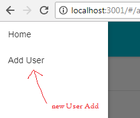
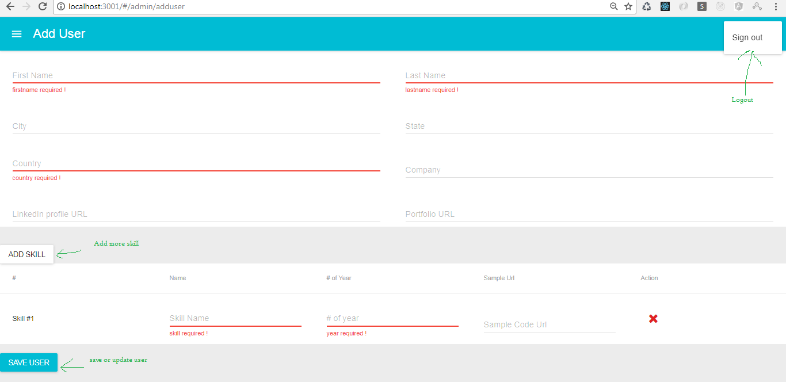

# User Curd
This project is prepare with react, redux, material-ui and node.


## How to serve

First copy the repo into your disk.

```bash
$ git clone  https://github.com/repo.git
```
# Install dependancies
  cd directory/Backend
  
  npm install
  
  npm start

 open browser  http://localhost:3001/


#Uses

#Menu


signout link , add user form

#AddUserForm
